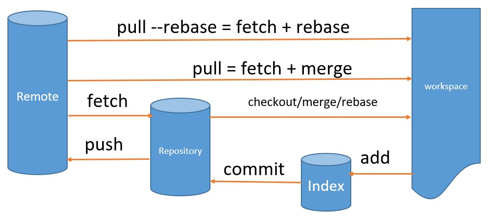

# git-second

各个命令对应的数据流动

## origin main 和 origin/main

这里实际上有三件事：origin main是两件不同的事情，并且origin/main是一件事。一共三件事。

- origin 是一个远程别名,`git remote -v` 就可以看到对应关系
- main 是本地分支
- origin/main 是一个远程跟踪分支（它是远程“origin”上名为“main”的分支的本地副本）

## add
add执行之前, 文件在workspace, 执行之后,文件在Index

执行add的前后, 可以通过`git status`看文件的状态

## commit
commit执行之后, 文件在本地repository

执行commit的前后, 可以通过`git log main --oneline`看提交的状态 ,其中main是分支名称

## push
push执行之后, 文件从本地上传到github的远程仓库, 也可以在远程仓库副本(origin/main)查看

执行push的前后, 可以通过`git log origin/main --oneline`看提交的状态 ,其中main是分支名称

## fetch
fetch执行之后, 文件从github远程下载到本地repository的FETCH_HEAD分支,同时也会下载到一份到origin/main

执行fetch的前后, 可以通过`git log FETCH_HEAD --oneline` 或者 `git log origin/main --oneline`看提交的状态

## merge
merge执行之后, 文件在本地repository的main分支

执行merge的前后, 可以通过`git log main --oneline`看提交的状态,其中main是分支名称